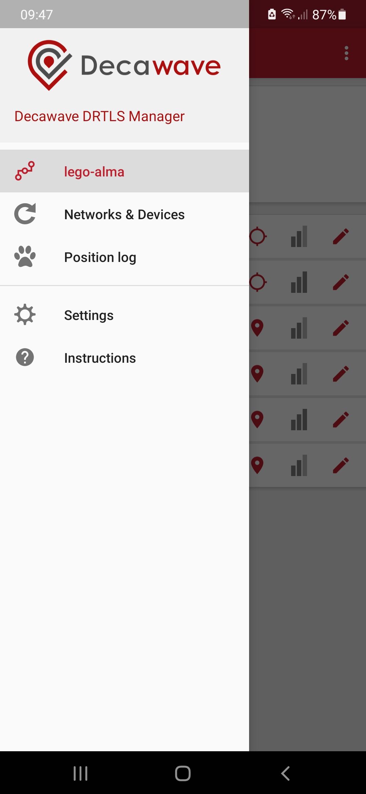
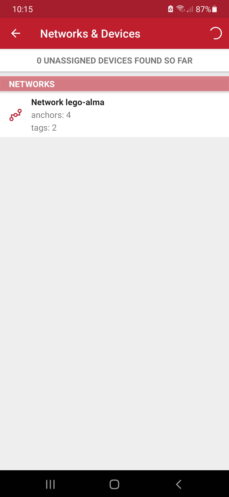
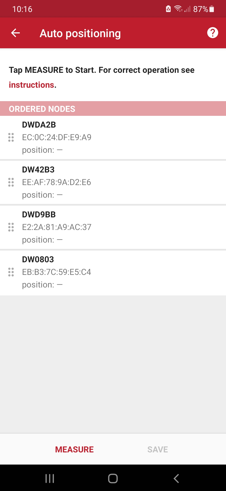
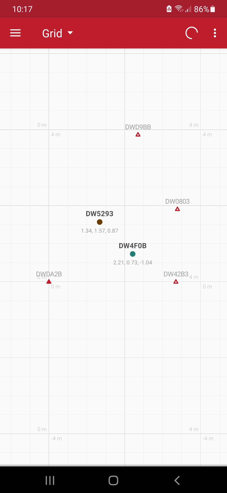

# LEGO-ALMA

## Position measurements utilizing Ultra-Wideband (UWB)

In the following project we describe a PoC with Decawave 
[DWB1001-DEV](https://www.qorvo.com/products/p/DWM1001-DEV) boards for [Lego-ALMA](
https://astro.uni-bonn.de/en/research/mm-submm-astronomy/projects-1/alma/lego-alma) (in German) 
at the Argelander Institute for Astronomy (AIfA), University Bonn. The underlying idea is to 
locate mobile antennas to demonstrate the functionality of an astronomical 
Radio-Interferometer, namely ALMA. When antennas move with respect to each other, 
their baselines do change, thus, revealing changes in the interferogram

Inspired by the article 
[Precise Realtime Indoor Localization With Raspberry Pi And Ultra-Wideband Technology](
https://medium.com/@newforestberlin/precise-realtime-indoor-localization-with-raspberry-pi-and-ultra-wideband-technology-decawave-191e4e2daa8c)
we developed a similar setup. The difference being, though, the position readout of the 
Decawave boards is realized via BLE. We utilize a raspberry PI 4 or Lego-ALMA's board computer, 
with a BLE USB-dongle attached, serving as BLE clients.

### UWB Sensor Set-Up

#### Download the Decawave Software Package

This [package](https://www.segger.com/downloads/jlink/)
includes documentation and the necessary software for the DWM1001-DEV board. 

#### Flash the UWB Sensors with J-Flash Light

After having installed the application, follow the next steps and flash all sensors (anchors & tags):

* Connect the sensor with a micro-USB data cable to your computer.
* Flash the image DWM1001-DEV module
  * Open J-Flash Lite.
  * Choose nrf52832_XXAA as device and SWD as interface, use default speed 1000. Click “OK”.
* Click “Erase Chip” to do a full chip erase.
* In Data File, click and browse the downloaded Decawave Software Package [DWM1001_PANS_R2.0.hex](
https://github.com/AIfA-Radio/lego-alma/blob/main/Factory_Firmware_Image/DWM1001_PANS_R2.0.hex) to flash, 
click “Program Device”.

#### Define anchors and tags via Decawave Android App

The entire UWB network will be configured utilizing the [Android SDK](
https://github.com/AIfA-Radio/lego-alma/blob/main/app/DRTLS_Manager_R2.apk). Alternatively, you may download it 
from [here](https://www.decawave.com/wp-content/uploads/2019/03/DRTLS_Manager_R2.apk).

Security Advice: 
* Some messengers (i.e. Signal) may prevent installation packages 
"DRTLS_Manager_R2.apk" being sent
* When trying to install apk-packages on a Smartphone, the installer will advise you that the 
package may originate from an insecure source.

If you have successfully installed the application on your Android Smartphone, 
you can now power up each sensor either via the micro-USB connector or batteries (switch). 
If the LEDs of the sensors flash green & red, the connection can be established via BLE. 
Now, seek the sensors with the Decawave App. On the tab "Networks & Devices" reaveals, 
if there are unassigned devices. 
Others may have already been identified and assigned to our network "lego-alma". 
Unidentified sensors need to be assigned to the same network now.

In most cases the lego-alma network, comprising 4 anchors and 1 to 8 tags, is already entirely defined,
see tab "lego-alma".
However, in case of pecularities (e.g. after a device reset), we may have to redefine the board and 
assign it to the lego-alma network. 

<table>
  <tr>
     <th style="text-align: center;">Initial Screen</th>
     <th style="text-align: center;">Network & Devices</th>
     <th style="text-align: center;">Auto Positioning</th>
  </tr>
  <tr>
    <td></td>
    <td></td>
    <td></td>
  </tr>
</table>
<table>
<tr>
     <th style="text-align: center;">Network Details</th>
     <th style="text-align: center;">Anchor Settings</th>
     <th style="text-align: center;">Tag Settings</th>
  </tr>
  <tr>
    <td></td>
    <td></td>
    <td></td>
  </tr>
</table>
<table>
  <tr>
     <th style="text-align: center;">Grid</th>
  </tr>
  <tr>
    <td></td>
  </tr>
</table>

[//]: # ()
[//]: # (|              Initial Screen               |                Network & Devices                |               Auto Positioning                |)

[//]: # (|:-----------------------------------------:|:-----------------------------------------------:|:---------------------------------------------:|)

[//]: # (| ![]&#40;./images/Screenshot_start_screen.jpg&#41; | ![]&#40;./images/Screenshot_unassigned_devices.jpg&#41; | ![]&#40;./images/Screenshot_auto_positioning.jpg&#41; |)

[//]: # ()
[//]: # (|              Network Details              |                 Anchor Settings                 |                 Tag Settings                  |)

[//]: # (|:-----------------------------------------:|:-----------------------------------------------:|:---------------------------------------------:|)

[//]: # (|   ![]&#40;./images/Screenshot_network.jpg&#41;    |       ![]&#40;./images/Screenshot_anchor.jpg&#41;       |       ![]&#40;./images/Screenshot_tag.jpg&#41;        |)

[//]: # (|                   Grid                    |)

[//]: # (|    ![]&#40;./images/Screenshot_grid.jpg&#41;      |)

If you are in the awkward position having to configure the UWB boards, please configure them as shown 
above. Caveat: solely one anchor (mandatory) can serve as an initiator.

#### Anchor Location & Auto Positioning

In most instances we will have to start from here in order to auto-position 
the anchors, since no action, as described before, is required.
This action is mandatory after the anchors were removed from a previous setup.
For best quality measurements, all 4 boards need to be in the same plane! After having performed
the auto-positioning, the anchors MUST NOT - NEVER EVER - be relocated.
It is also desirable to place the tags into the plane of the
anchors, which is - in the nature of Lego-ALMA - not feasible. The tags may therefore 
be lowered from that plane such, that the audience may just not be in LOS between tags and anchors.

The position of the anchor points can be determined automatically. 
Proceed to "Network Details" and select "Auto Positioning" on the vertical ellipsis. Click
"Measure" and, if successful, "Save". If unsuccesful, repeat "Measure". We are done. 
On "Grid" you can verify the current UWB setup (in units of meter) for 
achors and tags. Before you call the application on Lego-ALMA you will have to leave the Android App, 
since many USB-clients cannot access the tag's BLE module simultaneously.

For the time being we invoke

    sudo -E python3 ./src/DW_read_tags.py

Caveat: sudo rights are required, as scanning of BLE devices requires root on your client.

Note: This site - including manual & code - is still under construction. Thus, stay tuned. 
Comments welcome.

#### Contact

Ralf Antonius Timmermann, email: rtimmermann@astro.uni-bonn.de &
Toma Badescu, email: toma@astro.uni-bonn.de,
Argelander Institute for Astronomy (AIfA), University Bonn, Germany.